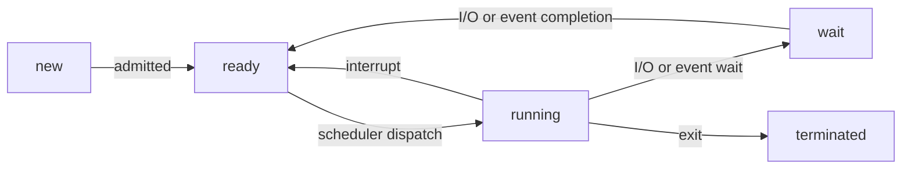

# Part II 


#  Process Concept & Operations

## Concepts of Process

** the building of processing **

- Pre-processor:like \#define,\#include ---try "gcc -E hello.c"
- Compiler and Optimizer
  - compiler:Syntax checking and analyzing
  - if no syntax:construct the intermediate codes
  - i.e,assembly
  - Optimizer :optimize the codes
  - check the parameter of gcc
- Assembler and Linker
  - assembler assembles hello.s and generate hello.o
  - the linker puts together the objects files as well as library files
  

compile multiple files?

makefile
## What is a process
### process in memory
a program is a program in execution
- a executable file load into mermory
- is Active
- process in memory :
  - text section:program code
  - stack
  - heap
  - data section
  - program counter 
  - content of register
  
- process state
  - a process executes changes states:
  - new
  - runnig
  - waiting :for I/O
  - ready--need CPU resources
  - terminated

the state diagram and the switch between




### PCB--process structure
**How to locate /represent a process**
- PCB:process control block or task control block
  - program state
  - program counter
  - CPU registers
  - CPU scheduling information
  - memory-management information
  - I/O status information
  - Accouting information
  process data structure in Linux
 - represents by struct *task_struct* in C
 - <linux/sched.h>

the relationship between program data& PCB

Conclusion on "what is a process"

1. a program in execution
2. only one process can be running on any processor at any instant
3. two processes maybe associated with one program
4. a process can be an execution environment for other codes.

## Process Operations

process:all the files,memory,accouting information

a system must provide the mechanism for:process identification,process creation,process execution,process termination

some basic system calls:

getpid(),fork(),exec*(),wait(),exit()

### Process identification
  - each process was given a unique id:process ID,**PID**
  - use `getpid()`
  - \#include <unistd.h>
  - '.':当前目录
  - use getpid()to check a program several times:get different PID
### Process creation 
  - a process may create several new processes
    - parent process and chidren process 
  - the first process(the kernel runs when booting up)---`init`
    - PID=1,is running the program code "/sbin/init"
    - the first task is to create more processes
  - tree hierarchy
    - all the process form a tree hierarchy
    - program blossoming:command to view tree:
    - "pstree" or "pstree -A"---for ascii-character-only on display
    - the termination can be happen at any time:the parent terminate before the children:turn a tree hierarchy to a forest(a process become a orphan)
    - **orphan process** may make a difference...become a tree ,and when it terminate nobody will know?
    - solve orphan process:re-parent operation
    - the relationship between parent and children
      - resource sharing options:all/subset/no
      - execution options:execute concurrently/parent wait for children
      - address space options:a duplicate of parent/a new program loaded into it
  - to create :system call `fork()`
    - `printf(...getpid()..);fork;print(...getpid());`:you will get three result(like 1234,1234,1235,not always cPID=pPID+1)
    - the last print executed twice
    - the fork():the parent and children executes the same codes,but not the same start:**the children starts where the fork()is returned**,the result of fork()will not loaded into children.
    - the parent process will run first,using the same files like program  counter and I/O devices
### program execution
  - fork( ) can only duplicate and run the same program-----use **exec( )**
  - execl( ) : a member of the exec() system call family(the family has 6 members),as an example
    - example: .... execl("/bin/ls","/bin/ls",NULL);.... it means "ls"/or ... execl("/bin/ls","bin/ls","-l",NULL)
    - $1^{st}$ argument:the program name
    - $2^{st}$ argument:the first argument to the program 
    - $3^{rd}$ argument:the second argument to the program
    - $4^{th}$ argument:indicate the end of list of arguments


- **the word after this function will not be executed anyway-----no new process will be created and the PCB will not change ,but the code will be replaced,it will run till meeting "exit()",and will not return the former program ,losing many data as well**
- note:  fork() vs exec()
- **fork()+exec()=?--**(duplicate and then replace,the children will use exit(-1)to terminate)-- write a system( ) library call----it will cause problem:the parents will first termination(actually cannot predict which will execute) 
- fork()+exec() is not enough ,use system call **fork()+exec()+wait()**: "**suspend** the executions of parent process挂起父进程""**wake** the parent up after the childern is terminated唤醒"

**about wait()**

- when to wake up: when **one of the child** processes changes from running to terminated
- does not suspend the calling process
- wait():usage: wait(NULL),has many cases while using 
  - case 1:the wait()system  can suspend the calling parent process
  - case 2: the parent will not suspend if there is no child  process or there no running child process(still need time)
- more powerful wait?needs to **wait for a particular  child or detect child status changing(wait()can only waits for ant of the child and detect the status termination only)**
  - waitpid()---read the man pages.
  - program termination


### make a summary

a process is created by **cloning**

- fork() :cloning is copying
- exec()
- wait()&waitpid()

the program exection is fundamental ,but not trivial:process is the place that hots a program and run it,and the exec*()changed the program the process is running,a process can run more than a program


## From Kernel Perspcetive

### dual mode

**kernel-space & user-space**:

|                  |                    kernel-space                     | user-space                                 |
| ---------------- | :-------------------------------------------------: | ------------------------------------------ |
| stored what      | kernel data structure,kernel program,driven devices | process memory,program code of the porcess |
| accessed by whom |                     kernel code                     | user  program & kernel code                |

a program will switch its execution from user mode and kernel mode

(example : getpid() need to execute system call)

**user time & system time**

user time : time spend on codes in user-space memory

system time : time spend on codes in kernel-space memory

total tunning time:user time \+ kernel time

use tool: time(`time ./filename`): total/user/sys time


### the system call

#### fork()

fork behaved like cell division 

it create the child process by "cloning" form the parent process,including:

- program counter :CPU register ，that is why they both execute from the same line of code after fork() returns
- Program code
- memeory
- opened files(kernel's internal)

does not clone:

- PID
- return value of fork()
- parent process
- running time:just created ,is 0

action: the start--kernel-space update--user-mode update ---finish

kernel-space updates: 

- the running time will reset to 0
- update pid
- the paretnt will have a new child and the child will have a pointer to its parent.

user -space update: copying...

> array of opened files :
>
> array index:
>
> 0-- standard of input stream :file *stdin
>
> 1-- standard of output stream :file *stdout
>
> 2-- standard error stream:file *stderr
>
> 3/beyond-- storing the file you opened,e.g,fopen(),open,etc

that's why the parents process shares the same terminal output system with the child process

#### exec\*()

action:start,end

process itself does not change

user-space memory: local veriable,dynamically\-allocated memory will be cleared,and the global variable will reset based on new code,code \+ constant will changed to new program code

#### \(\*\*\)wait() \&exit()

exit()----child side : not really remove the child process ,remain the entry of the child in the process table(template state)

The child is now called zombie. Its storage in the kernel-space memory is kept to a minimum The PID (1235 in this example) and process structure are owned by the child.

wake up the parent: The kernel notifies the parent of the child process about the termination of its child. The notification is a signal called **SIGCHLD**.

signal:

• What is signal? – A software interrupt – It takes steps as in the hardware interrupt

 • Two kinds of signals – Generated from user space 

• Ctrl+C, kill() system call, etc. – Generated from kernel and CPU 

• Segmentation fault (SIGSEGV), Floating point exception (SIGFPE), child process termination (SIGCHLD), etc. 

• Signal is very hard to master, will be skipped in this course – Reference: Advanced Programming Environment in UNIX – Linux manpage

summary **exit()**

Step (1) Clean up most of the allocated kernel-space memory. 

Step (2) Clean up all user-space memory. 

Step (3) Notify the parent with SIGCHLD

Although the child is still in the system, it is no longer running. There is no program code!!! It turns into a mindless zombie…


wait()----parent side: see the SIGCHLD signal and handle it.

The kernel sets a signal handling routine (and it is a function pointer) to the process. That signal handling routine will be executed when SIGCHLD comes.

By default, every process does not respond to the SIGCHLD signal (the signal handlers are set only when wait() is called). 

When SIGCHLD comes, the signal handling routine is invoked! 

Note: since the parent is still inside the system call, instead of the original program code, the parent process is still blocked in some sense…

**Default Handling of SIGCHLD** 

1. Accept and remove the SIGCHLD; 
2.  Destroy the child process that sends her the signal.

**case 2-**--the wait() is called after the child already termintated,which is safe

in case 2,the SIGCHlD is also sent to parent before,and when the wait() is called ,it can return and kill the child process completely.

short summary of **exit() &wait()**

- A process is turned into a zombie when… 
  -  The process calls exit(). 
  -  The process returns from main(). 
  -  The process terminates abnormally. 
    - You know, the kernel knows that the process is terminated abnormally. Hence, the kernel invokes exit() by itself.

- Remember why exec*() does not return to its calling process in previous example…
- wait() is to reap zombie child processes 
  -  You should never leave any zombies in the system. 
-  Linux will label zombie processes as `<defunct>`. 
  -  To look for them:`ps aux | grep defunct` 
-  Learn waitpid() by yourself…?

If a orphan does not have a parent wait() when terminate--may init a new parent .

the role of wait() in the OS:

Why calling wait() is important – It is not about process execution/suspension… – It is about system resource management. 

Think about it: – A zombie takes up a PID; – The total number of PIDs are limited; • Read the limit: “cat /proc/sys/kernel/pid_max” – What will happen if we don't clean up the zombies?

## summary

concepts:

- process data & memoty
- PCB+ user-space mermory

operations

- fork()
- exec*()
- wait()+exit()----come together , calling wait() is imporrtant
- so..what is the kernel  doing?...

# Threads


## Thread

### Motivation of Multi-Threading and Concepts

Thread concepts:why use , structure in memory, benefits and challenge, thread models

Progreamming :Basic programming;implicit threading

motivation: 

- application side:most software applications are multithreaded,each application is implemented as a process with several threads of control.(web browser or wiord processor)
  - still remember what kind of data are include in a process:
  - text data,statck,heap inuser-space memory
  - PCB in kernel-space memory
- system side:modern computers usually contain multicores,but each processor can run only one process ata time,so to improve the efficiency:
  - assign one task to each core
  - real parallelism
  - the process cannot visit another process's data and memory

**concurrency vs. parallelism**

### internals

Code: 

- all the threads use the same code.
- a thread starts with onr specfic function----named it the thread function
- a thread function can invoke other functions or system calls
- a thread could never return to the caller of the thread function

Global variables:

- all thread share the same global variable zone and the same dynamically allocated memory
- all thread can read from and write to

Local variables:

- each therad has its own memory range for local variable
-  so the stack is a private zone

### Benefits

- allow an application to do parallel tasks simulaneously
- ease in data sharing
- peocess share resources via shared memory or message passing
- Economy
  - allocation memory and resources for process creations is costly ,dozens of time tha creation threads...
  - context-switch between processes is also costly,several times of slower
- Scalablilty: thread may be running in parallel on different cores

### programming challenges

- indentifying tasks: divide seperate and concurrent tasks
- balance: tasks should perform equal work of equal value
- data splitting: data must be divided to run on seperate cores
- tdata dependency:synchronization is needed
- testing and debugging 

## Thread models

thread should include :

- data/resources in user-space memory
- structure in kernel

provide thread support:

- user thread: implement in user space
- kernel thread: supported and managed by kernel


1.**many-to-one models** :(many in user space and one in kernel)

- all the threads are mapped to one process structure in the kernel
- easy for the kernel to implement 
- drawback:when a blocking system call is called ,all the thread will be **blocked**
- old UNIX & green thread 

2.**one-to-one**

- each thread is mapped to one process structure in the kernel
- a high degree of **concurrency**
- drawback: cannot create too many threads as it is restricted by the size of the kernel memory
- most Linux and Windows

a process ,without multi-threading,is actually one thread for the scheduler.(when the schduler interets in process / thread)

3.**many-to-many model**

- avoid drawbacks in many-to-one and one-to-one----cannot be blocked , have a high degree of concurrency
- but most OS does not use man-to-many model(the drawback of one-to-one is not fatal)


## Basic Programming

Thread library-----provide the programmer with an API for creating and managing threads.

three main library threadings:

- POSIX Pthreads(user level or kernel level)
- Windows (kernel level)
- Java(implements using Windows API or Pthreads)

### creating multipule threads

asynchronous threading 

- parent resumes execution after creating a child 
- parent and child executes concurrency
- each thread run independently

synchronous threading

- fork-join strategy : parents wait for children to terminate
  - significant data sharing

### Pthreads:  process is similar to thread

|                                | process             | thread                  |
| ------------------------------ | ------------------- | ----------------------- |
| creation                       | fork()              | pthread_create()        |
| I.D. type                      | PID,an integer      | "pthread_t",a structure |
| who am i?                      | getpid()            | pthread_self()          |
| wait for the child termination | wait() or waitpid() | pthread_join()          |
| terminaion                     | exit()              | pthread_exit()          |
| kill?                          | kill()              | pthread_kill()          |

issue 1:create thread

```c
int main(void)
   pthread_t tid;
	pthread_create(&tid,NULL,hello,"hello world");//函数名和函数需要的参数
	pthread_join(tid,NULL);
return 0;
}
void *hello (void * input)
{
   printf("%s",(char*)input);
   pthread_exit(NULL);
}
```

issue 2: passing parameter: local variable can be changed ---the stack of the new thread is on the same piece of the user-space memory as the main thread,not a new process,the pthread_create only create an address to the new thread ,the address is a pointer pointing to a variable stack of the main thread.

issue 3:multiple threads: 

```c
pthread_t tid[5];
for(i=0;i<5;i++)
pthread_create(tid[i],NULL,xxx,xxx);
for(i=0;i<5;i++)
  pthread_join(tid[i],NULL);
```

issue 4: return value---thread termination ,**passing return value.**

```c++
void do_your_job(void *input){
   ...
   *output=.....;
pthread_exit(output);
}
...

pthread_join(tid,(void**)output);
```


other threading -- windows thread or java threads.

## Implicit Threading

- applications are containing hundreds or even thousands of threads

  - program correctness is more difficult with explicit threads

- how to address the programming difficulties?

  - transfer the creation and managements of the threadings from programmers  to compliers and run-time libraries
  - implicit threading

  two methods

  1.thread pools

  2.OpenMP

### !!!thread pools

problem with multithreaded servers

- time required to create threads,which will be discarded once completed their work
- unlimited threads could exhaust the system resources

solve:

- thread pool
- idea:create a number of threads in a pool where they wait for a work
- procedure:
  - awaken a thread if necessary
  - returns to the pool after completion
  - wait until one becomes free if the pools cpntains no available thread
- advantages
  - usually sightly faster to service a request with an existing thread than create a new thread
  - allow the number of threads in the applications to be bound to the size of the pool

### OpenMP

provides supports for parallel programming in shared-memory environments

set of compliers directives and an API for C,C++,FORTRAN

## Threading Issues

### semantics of fork() and exec()

1.**fork():some UNIX has two versions:**

- the new process duplicates all threads 
- duplicates only the thread that invokes fork()

exec(): usually work as normal:

- replace the running process ,includind all threads

2.**signal handling**

signals are used in UNIX systems to notify a process that a particular event has occurred

- asnychronous signal and synchronous signal
- default handler or user-defined handler

where should a signal be delivered in multi-thread program?

- to the thread signal applies
- all the threads
- a certain thread
- assign  a specific thread to receive all the signals of all the threads

deliver a signal to specific thread to receive all the signals for the process

3.**thread cancellation**

terminating a thread before it has finished

two genernal approaches:

- asynchronous cancellation terminates the target thread immediately
  - problem:troublesome then updating data
- defferred cancellation:allow the target thread to periodically check if it should be cancelled(can be cancelled safely)
-  three models: asynchronous,defferred,off(disabled cancellation)
- default : defferred

4.**thread-local storage**

some applications ,each threads may needs its own copy of certain data.

thread-local stroage:TLS

- TLS is visible across function invocations
- similar to static data
- TLS data are untique to each thread

## summary of thread

- virtually all morden OSes support multi-threading
  - a thread is a basic unit of the CPU utilization
  - each comprises a thread ID,a program counter,a,register set,a stack
  - all the threads within a process share code section ,data,section,other resources like openfiles and signals
- take great care when writing multi-threaded programs,and also--
  - mutual exclusion
  - synchronization

# Process communication & Synchronization

the processes within a system may be

- independent
- cooperating

any process that  shares the data is a cooperating process

## interprocess communication ---IPC

two models:

- shared memory
- message passing

IPC is used for exchanging data between processes

cooperating processes need IPC for exchanging data


two nodels：

### shared memory

- establish a shared memory region,read/write to share region
- accesses are treated as routine memory accesses
- faster

**producer-consumer problem**

a buffer os needed to allow processes to run concurrently

the requirement: 

**a buffer** 

is a shared object,and is a queue 

problem: when producer wants to put  anew item but the buffer is already full

solution: the producer need to suepended ,and the consumer should wake the producer up after it has dequeue an item

problem: when comsumer wants to dequeue an item but it is empty

solution:  the consumer is suspended and the producer should wake the cinsumer up...

**a producer process**  

produces a unit of data ,and writes that a piece of data to the tail of the buffer

**a consumer process**

removes a unit of data from the head of the bounded buffer at one time


### message passing

need a message queue to exchange

communictating processes may reside on different computer conntected by a network

IPC provide : **send**+**receive **

- exchange message 
- require kernel intervention
- easier to implement in a distributed system

if two process wish to communicate,they need:

- establish a communication link between
- exchange messages via send/receive

issues:

- naming: direct/indirect
  - direct:
    -  opreations: send and receive
    - properties of 
  - indirect communication
    - allow a link to be associated with at most two processes
    - allow one process at  a time to execute a receive opreation
    - allow the system to select arbitrarily the receiver ,and sender is notified who the receiver is
    - the mailbox is owned by the process (ownership may be passed)and the OS(neede a method to create ,send/receive.delete)
- synchronization : synchronous-- blocking/asynchronous-- non- blocking
  - dofferent combinations :1.when the send and the receive are blocking , we have a rendezvous between the processes; 2. other conbinations need buffering

- buffering
  - messages reside in a temporary queue , whic can be implemented in three ways:
    - zero capacity--no message qre queued, sender must wait for the receiver(no buffering)
    - bounded capacity -- finite length of n mesages,sender must wait if link is full
    - undounded capacity - infinite length,sender never waits


### POSIX shared memory

POSIX shared memory is orgranized using memory-mapped file,associate the region of shared memory with a file.

illustrate wth the producer-consumer problem:

**producer**

-  create a shared memory object
  - shm_fd=shm_open (name,O_CREAT |O_RDWR,0666);(perminssions )
- configure object size
  - ftruncate(shm_fd,SIZE);
- establish a memory-mapped file containing the object
  - prtr mmap(0,SIZE,PORT_WRITE),MAP_SHARED,shm_fd,0);(changes to the shared-memory object)

**consumer**

- open the shared-memory obect
  - shm_fd=shm_open(name,O_RDONLY,0666);
- memory map the object
  - ptr=mmap(0,SIZE,PORT_READ,MAP_SHARED,shm_fd,0);
- remove the shared memory object
  - shp_unlink(name);

### Sockets

a sockets is defined as an endpointer for communication(over a network)

- a pair of processes employ a pair of sockets
- a socker is indentified by an IP address and a port number
- all ports below 1024 are used for standard services
  - telnet server listens to port 23
  - FTP server:port 21
  - HTTP server :port 80

Socket uses a client-server architecture

-  server waits for incoming client request by listening to a specific port
- accepts a connection from the client socket to complete the connection

all connection must be unique(establishing a new connection on the same host needs another port>1024)

special IP address 127.0.0.1(loopback)refers to itself

### Pipes

Pipe ia **a shared memory**

- using pipes is a way to realize IPC
- acts as a conduit two processes to communicate

issues :

- communication: unidirectional/bidirectional
- half/full duplex
- must the relationship exists between the communicating processes
- pipes used over a network

two common pipes: ordinary pipes and named pipes

**ordinary pipes**

- no name  in file system
- only used for related process(parent-child relationship)
- unidirectional 
- ceases to exit after communication has finished
- allow communication in standard producer-consumer style
  - producer write to one end and the consumer reads from the other end

UNIX pipe

- UNIX treats a pipe as a special file (child inherits it from parent)
  - create : pipe(int fd[]);fd[0]-read end,fd[1]-write end
  - create accesses the ordinary read(),write()system calls
  - fork() duplicates parent's file descriptors,and parents and child use each end of the pipe
- pipes are anonymous 

**named pipes**

- UNIX treats as typical file:mkfifo(), open(), read (), write(),close()
- no parent-child relaitionship is necessary(or processes must reside one the same machine)
- several processes can use the named pipes for communication
- continue to exist
- communication is bidiectional(still half-duplex)

[课程主页](staff.ustc.edu.cn/~ykli/os2022)

主观题规范：逻辑/语言规范           

